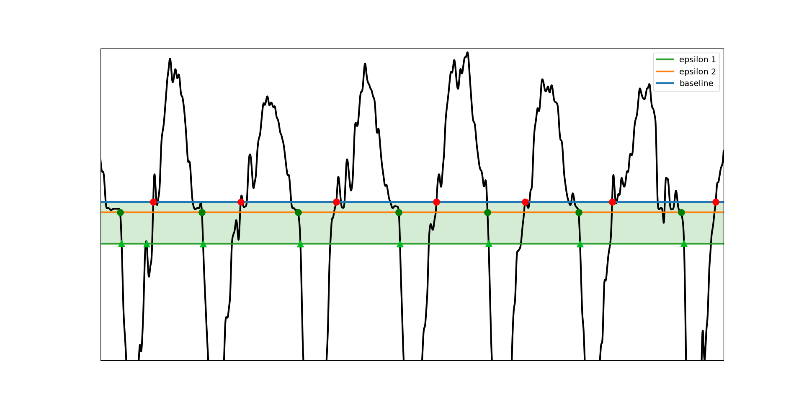
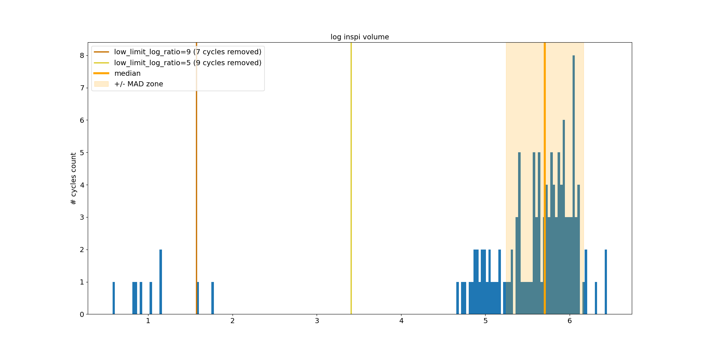
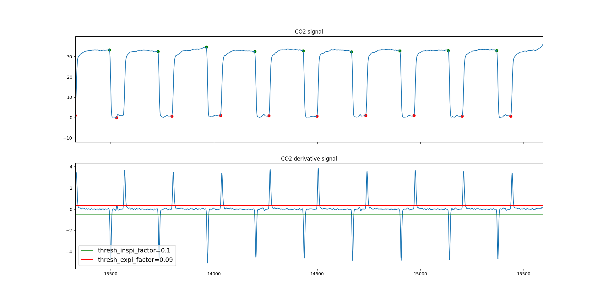

.. _handling_parameters:

Handling parameters
===================

Why such a section ?
--------------------

For ECG or Respiration signal processing, :py:mod:`physio` proposes :py:func:`~physio.compute_ecg` and :py:func:`~physio.compute_respiration`,
some high-level wrapper functions that deeply simplify the workflow for the user.

However, these functions come with a tree of parameters that have been predefined by the developers.
Variability during data acquisition (subject, acquisition system) can affect the recorded signals.
Such variability may make some predefined parameters of :py:mod:`physio` inappropriate. 
 
In this situation, we encourage the user to fine tune certain parameters by re-assigning values to the keys of the `parameters` dictionary 
got from the :py:func:`physio.get_ecg_parameters` or :py:func:`physio.get_respiration_parameters`. 
**To fine-tune parameters properly, a good understanding of each parameter's role is required...** and this why we wrote this section. 

Organization
------------

This tutorial is organized into two major sections, each of which is divided into multiple subsections:
  1. Respiration parameters

     - sentor_type = airflow

        - preprocess
        - smooth
        - cycle_detection
        - cycle_clean
        - baseline

     - sentor_type = belt

        - preprocess
        - smooth
        - cycle_detection
        - cycle_clean
        - baseline

     - sentor_type = co2
     
        - preprocess
        - smooth
        - cycle_detection
        - baseline
        - cycle_clean

  2. ECG parameters

     - human

        - preprocess
        - peak_detection
        - peak_clean
     - rat

        - preprocess
        - peak_detection
        - peak_clean

1. Respiration Parameters
-------------------------

For now, we have developed capabilities in :py:mod:`physio` to process respiration recorded with three types of sensors: `airflow`, `belt`, and `co2`.  
The sensor type drives many of the subsequent parameters, from preprocessing to metric computation, and therefore affects which metrics can be computed.  
Note that for the `rat` species, `rat_plethysmo` is equivalent to an `airflow` signal, even though it is much faster. 
Similarly, `rat_etisens_belt` is equivalent to a human `belt` signal.

This section will detail the parameter settings for each of these sensor types.

a. `airflow`
^^^^^^^^^^^^

Default parameters dictionary for `airflow` sensor (for `human` species). 
In the case of `rat_plethysmo`, our description is not detailed because the approach is the same; only the parameters are optimized to match the rat’s respiratory frequency.

::

    {
        'baseline': {
            'baseline_mode': 'median'
        },
        'cycle_clean': {
            'low_limit_log_ratio': 4.5,
            'variable_names': ['inspi_volume', 'expi_volume']
        },
        'cycle_detection': {
            'epsilon_factor1': 10.0,
            'epsilon_factor2': 5.0,
            'inspiration_adjust_on_derivative': False,
            'method': 'crossing_baseline'
        },
        'preprocess': {
            'band': 7.0,
            'btype': 'lowpass',
            'ftype': 'bessel',
            'order': 5
        },
        'sensor_type': 'airflow',
        'smooth': {
            'sigma_ms': 60.0,
            'win_shape': 'gaussian'
        }
    }

- `preprocess`:
"""""""""""""""

The `preprocess` key controls how the raw respiratory signal is filtered. This is done using `scipy.signal.iirfilter` (see: https://docs.scipy.org/doc/scipy/reference/generated/scipy.signal.iirfilter.html).  
Several subkeys relate to controlling this filtering:

  - `btype`: The type of filter. In this context, we set a `lowpass`, but it could be `bandpass` to remove slow drifts by setting low and high cutoffs.  
  - `band`: The cutoff frequency. For a `lowpass`, this is the high cutoff, set to 7 Hz by default. **This parameter strongly affects the precise timing of respiratory cycle timepoint detection.** Decreasing this value increases signal smoothness but may artificially shift the inspiration-expiration transition.  
  - `ftype`: The type of filter. For example, `bessel` (default) or `butter`. We recommend `bessel` because it preserves time-domain fidelity, although it is slightly less steep in frequency cutoff.  
  - `order`: The filter order. Default = 5. Higher order → steeper frequency cutoff but increases the risk of phase distortion.  

- `smooth`:

The `smooth` key controls how the filtered respiratory signal is smoothed again using convolution with a kernel.  
Subkeys relate to the size and shape of this kernel:

  - `win_shape`: Default = `gaussian`. The kernel shape is Gaussian. It can be set to `rect` for a rectangular kernel, but we recommend `gaussian` because it reduces discontinuities in time, even if its frequency response is less steep than `rect`.  
  - `sigma_ms`: Kernel size in milliseconds. Higher → smoother; lower → less smooth. Default = 60 ms.  

- `cycle_detection`:

This key controls how the main timepoints (inspiration and expiration) are detected:

  - `method`: `crossing_baseline` in this case, because the signal returns to baseline when there is no flow (unlike belt and CO2 signals, where the method is set to `min_max`).  
  - `epsilon_factor1`: Defines a horizontal confidence zone just below the true baseline, where the low part = baseline - `epsilon` * `epsilon_factor1`, with `epsilon` = (baseline - np.quantile(resp, 0.1)) / 100. See Fig X.  
  - `epsilon_factor2`: Defines the higher part of the confidence zone: baseline - `epsilon` * `epsilon_factor2`. `epsilon_factor1` is higher than `epsilon_factor2` to search the low part of the confidence zone. See Fig X.  
  - `inspiration_adjust_on_derivative`: Sometimes the end-of-expiration plateau drifts downward, causing premature detection of inspiration. Activating this parameter adjusts detection using the slope's minimum (second derivative). Default = False.  

- `cycle_clean`:

This key controls how already detected timepoints are cleaned.  
Small oscillations in a noisy signal can cause very small cycles to be detected when the signal crosses the baseline. Subkeys specify criteria for identifying these outliers:

  - `variable_names`: Names of respiratory features used to detect outliers. Default = ['inspi_volume', 'expi_volume']. Volumes are chosen because they capture cycles that are too small both in time and amplitude.  
  - `low_limit_log_ratio`: Features are often non-normally distributed and are log-transformed before threshold estimation. The threshold for outliers is computed as median - MAD * `low_limit_log_ratio`. Higher `low_limit_log_ratio` → smaller detected cycles → fewer outliers detected. See Fig X.  

- `baseline`:

Controls how the baseline of the signal is computed:

  - `baseline_mode`: Default = `median`, meaning the baseline is the median level of the signal (robust and efficient). Alternatives: `zero` (baseline = 0) or `mode` (mode of the signal distribution).  

b. `belt`
^^^^^^^^^

Default parameters dictionary for `belt` sensor:
In the case of `rat_etisens_belt`, our description is not detailed because the approach is the same; only the parameters are optimized to match the rat’s respiratory frequency.

::

    {
        'baseline': None,
        'cycle_clean': {
            'low_limit_log_ratio': 8.0,
            'variable_names': ['inspi_amplitude', 'expi_amplitude']
        },
        'cycle_detection': {
            'exclude_sweep_ms': 200.0,
            'method': 'min_max'
        },
        'preprocess': {
            'band': 5.0,
            'btype': 'lowpass',
            'ftype': 'bessel',
            'order': 5
        },
        'sensor_type': 'belt',
        'smooth': {
            'sigma_ms': 40.0,
            'win_shape': 'gaussian'
        }
    }

- `preprocess`:  
"""""""""""""""

The `preprocess` key controls how the raw respiratory signal is filtered. This is done using `scipy.signal.iirfilter` (see: https://docs.scipy.org/doc/scipy/reference/generated/scipy.signal.iirfilter.html).  
Several subkeys control this filtering:  

  - `btype`: The type of filter. In this context, we set a `lowpass`, but it could also be `bandpass` to remove slow drifts by setting low and high cutoffs.  
  - `band`: The cutoff frequency. For a `lowpass`, this is the high cutoff, set to 5 Hz by default. **This parameter strongly affects the precise timing of respiratory cycle timepoint detection.** Decreasing this value increases smoothness but may artificially shift the inspiration–expiration transitions.  
  - `ftype`: The filter type. For example, `bessel` (default) or `butter`. We recommend `bessel` because it preserves time-domain fidelity, although it is less steep in frequency cutoff.  
  - `order`: The filter order. Default = 5. Higher order → steeper frequency cutoff but with increased risk of phase distortion.  

- `smooth`:
""""""""""" 

The `smooth` key controls how the filtered respiratory signal is smoothed again using convolution with a kernel.  
Subkeys define the size and shape of this kernel:  

  - `win_shape`: Default = `gaussian`. The kernel shape is Gaussian. It can be set to `rect` for a rectangular kernel, but we recommend `gaussian` because it reduces temporal discontinuities, even if its frequency response is less steep than `rect`.  
  - `sigma_ms`: Kernel size in milliseconds. Higher → smoother; lower → less smooth. Default = 40 ms.  

- `cycle_detection`:
"""""""""""""""""""" 

This key controls how the main timepoints (inspiration and expiration) are detected:  

  - `method`: `min_max` in this case, because the signal captures trunk circumference. The signal reaches its maximum at the inspi–expi transition and its minimum at the expi–inspi transition.  
  - `exclude_sweep_ms`: Time window in milliseconds swept along the signal to prevent detecting multiple peaks (maxima and minima) in noisy data. Higher = risk of losing true peaks and cycles; lower = risk of detecting spurious small outlier cycles.  

- `cycle_clean`:  
""""""""""""""""

This key controls how already detected timepoints are cleaned.  
Small oscillations in a noisy signal can cause very small cycles to be detected. Subkeys specify criteria for identifying these outliers:  

  - `variable_names`: Names of respiratory features used to detect outliers. Default = ['inspi_amplitude', 'expi_amplitude']. Amplitudes are chosen because they capture cycles that are too small in both time and amplitude.  
  - `low_limit_log_ratio`: Features are often non-normally distributed and are log-transformed before threshold estimation. The outlier threshold is computed as median - MAD * `low_limit_log_ratio`. Higher `low_limit_log_ratio` → smaller detected cycles → fewer outliers detected. See Fig X.  

- `baseline`:
"""""""""""""  

`None`, because this is not a `crossing_baseline` signal.  

c. `CO2`
^^^^^^^^

Default parameters dictionary for `co2` sensor:

::

   {
       'baseline':None,
       'cycle_clean': None,
       'cycle_detection': {
           'clean_by_mid_value': True,
           'method': 'co2',
           'thresh_expi_factor': 0.05,
           'thresh_inspi_factor': 0.08
       },
       'preprocess': {
           'band': 10.0,
           'btype': 'lowpass',
           'ftype': 'bessel',
           'order': 5
       },
       'sensor_type': 'co2',
       'smooth': {
           'sigma_ms': 40.0,
           'win_shape': 'gaussian'
       }
   }

- `preprocess`:
"""""""""""""""

The `preprocess` key controls how the raw respiratory signal is filtered. This is done using `scipy.signal.iirfilter` (see: https://docs.scipy.org/doc/scipy/reference/generated/scipy.signal.iirfilter.html).  
Several subkeys control this filtering:

  - `btype`: The type of filter. In this context, we set a `lowpass`, but it could also be `bandpass` to remove slow drifts by setting both low and high cutoffs.  
  - `band`: The cutoff frequency. For a `lowpass`, this is the high cutoff, set to 10 Hz by default. **This parameter strongly affects the precise timing of respiratory cycle timepoint detection.** Decreasing this value increases smoothness but may artificially shift the inspiration–expiration transitions.  
  - `ftype`: The filter type. For example, `bessel` (default) or `butter`. We recommend `bessel` because it preserves time-domain fidelity, although it is slightly less steep in frequency cutoff.  
  - `order`: The filter order. Default = 5. Higher order → steeper frequency cutoff but increases the risk of phase distortion.  

- `smooth`:
"""""""""""

The `smooth` key controls how the filtered respiratory signal is further smoothed using convolution with a kernel.  
Subkeys define the size and shape of this kernel:

  - `win_shape`: Default = `gaussian`. The kernel shape is Gaussian. It can be set to `rect` for a rectangular kernel, but we recommend `gaussian` because it reduces temporal discontinuities, even if its frequency response is less steep than `rect`.  
  - `sigma_ms`: Kernel size in milliseconds. Higher → smoother; lower → less smooth. Default = 40 ms.  

- `cycle_detection`:
""""""""""""""""""""

This key controls how the main timepoints (inspiration and expiration) are detected:

  - `method`: `co2` in this case, meaning a dedicated method (not a true `min_max`). The goal is to detect transitions from expiration to inspiration at the end of the expiration plateau, and transitions from inspiration to expiration at the end of the inspiration plateau, using the first derivative of the signal.  
  - `thresh_expi_factor`: To detect expiration timepoints, we search for crossings in the first derivative just above 0 using a threshold. Indeed, nspiration–expiration transitions appear as upward-oriented peaks in the derivative. The threshold is computed as `thresh_expi = max_ * thresh_expi_factor`, where `max_` is the maximum of the derivative signal. Thus, `thresh_expi_factor` defines the fraction of the maximum derivative used to set the threshold. See Fig X.  
  - `thresh_inspi_factor`: To detect inspiration timepoints, we search for crossings in the first derivative just below 0 using a threshold. Indeed, expiration–inspiration transitions appear as downward-oriented peaks in the derivative. The threshold is computed as `thresh_inspi = min_ * thresh_inspi_factor`, where `min_` is the minimum of the derivative signal. Thus, `thresh_inspi_factor` defines the fraction of the minimum derivative used to set the threshold. See Fig X.  
  - `clean_by_mid_value`: Occasionally, abnormal cycles are detected where expiration points are too high to be real transitions. To correct this, a cleaning step computes `mid_value = (np.median(insp_values) + np.median(exp_values)) / 2`. If the expiration point lies above this value, the cycle is removed. Default = True. See Fig X.  

- `cycle_clean`:
""""""""""""""""

None. We did not develop a dedicated `cycle_clean` method for CO2 signals, because they are generally clean enough, and partial cleaning is already performed in the `cycle_detection` step. Moreover, volumes are not computed for this type of signal and therefore cannot be used as criteria for cleaning.  

- `baseline`:
"""""""""""""

None. No need for baseline in CO2 context.

2. ECG parameters
-----------------

For now, we have developed capabilities in :py:mod:`physio` to process ECG recordings from two species: `human` and `rat`.  
The species type determines many of the preprocessing parameters, mainly because the expected heart rate is much higher in rodents than in humans.  

Note that we did not develop a preset dedicated to mice, as we did not have data available to generate one. However, the `rat` parameters can likely be slightly tuned to fit the higher expected heart rate of mice.  

In addition, any heart rate range (from any species or under any behavioral condition) can theoretically be processed by :py:mod:`physio` simply by tuning the parameters accordingly. Feel free to do so.  

This section details the parameter settings for each of the two species predefined in :py:mod:`physio`.  

a. `human`
^^^^^^^^^^

Default parameters dictionary for `human_ecg`:

::

    {
        'peak_clean': {
            'min_interval_ms': 400.0
        },
        'peak_detection': {
            'exclude_sweep_ms': 4.0,
            'thresh': 'auto'
        },
        'preprocess': {
            'band': [5.0, 45.0],
            'ftype': 'bessel',
            'order': 5
        }
    }

- `preprocess`:
"""""""""""""""

The `preprocess` key controls how the raw ECG signal is filtered. This is done using `scipy.signal.iirfilter` (see: https://docs.scipy.org/doc/scipy/reference/generated/scipy.signal.iirfilter.html).  
Several subkeys control this filtering:

  - `band`: The cutoff frequencies of the filter. Set to [5.0, 45.0] Hz by default. The aim of this frequency band is to increase the signal-to-noise ratio, where the signal corresponds to the R peaks and the noise is the rest. The 5–45 Hz range isolates the human R-peak frequency band, facilitating subsequent R-peak detection.  
  - `ftype`: The filter type. For example, `bessel` (default) or `butter`. We recommend `bessel` because it preserves time-domain fidelity, although it is slightly less steep in frequency cutoff.  
  - `order`: The filter order. Default = 5. Higher order → steeper frequency cutoff but increases the risk of phase distortion.  
  
- `peak_detection`:
"""""""""""""""""""

The `peak_detection` key controls the methods by which R peaks are detected. The idea is to set a threshold above which peaks (hopefully R peaks) are detected.  
The two questions are: "which threshold?" and "how to remove extra peaks that are above the threshold but are not R peaks?".  
Subkeys address these questions:

  - `thresh`: Default = `auto`. If a float is passed, this float value is used as a horizontal threshold above which R peaks are detected. `auto` means the threshold is automatically computed as half of the 99th percentile of the signal: thresh = np.quantile(clean_ecg, 0.99) / 2.  
  - `exclude_sweep_ms`: Default = 4 milliseconds. Time window in milliseconds swept along the signal to prevent detecting multiple noisy peaks. Higher = risk of losing true R peaks; lower = risk of detecting extra non-R peaks.  

- `peak_clean`:
"""""""""""""""

This key controls post-cleaning of detected R peaks by setting a minimum horizontal distance between R peaks (RR intervals) below which RR intervals are removed.  
The only subkey is:

  - `min_interval_ms`: Default = 400 milliseconds in this case of a human. A higher value risks removing true RR intervals, which may happen in individuals with fast heart rates.  

b. `rat`
^^^^^^^^

Default parameters dictionary for `rat_ecg`:

::

    {
        'peak_clean': {
            'min_interval_ms': 50.0
        },
        'peak_detection': {
            'exclude_sweep_ms': 4.0,
            'thresh': 'auto'
        },
        'preprocess': {
            'band': [5.0, 200.0],
            'ftype': 'bessel',
            'order': 5
        }
    }

- `preprocess`:
"""""""""""""""

The `preprocess` key controls how the raw ECG signal is filtered. This is done using `scipy.signal.iirfilter` (see: https://docs.scipy.org/doc/scipy/reference/generated/scipy.signal.iirfilter.html).  
Several subkeys control this filtering:

  - `band`: The cutoff frequencies of the filter. Set to [5.0, 200.0] Hz by default. The aim of this frequency band is to increase the signal-to-noise ratio, where the signal corresponds to the R peaks and the noise is the rest. The 5-200 Hz range isolates the rat R-peak frequency band, facilitating subsequent R-peak detection.  
  - `ftype`: The filter type. For example, `bessel` (default) or `butter`. We recommend `bessel` because it preserves time-domain fidelity, although it is slightly less steep in frequency cutoff.  
  - `order`: The filter order. Default = 5. Higher order → steeper frequency cutoff but increases the risk of phase distortion.  

- `peak_detection`:
"""""""""""""""""""

The `peak_detection` key controls the methods by which R peaks are detected. The idea is to set a threshold above which peaks (hopefully R peaks) are detected.  
The two questions are: "which threshold?" and "how to remove extra peaks that are above the threshold but are not R peaks?".  
Subkeys address these questions:

  - `thresh`: Default = `auto`. If a float is passed, this float value is used as a horizontal threshold above which R peaks are detected. `auto` means the threshold is automatically computed as half of the 99th percentile of the signal: thresh = np.quantile(clean_ecg, 0.99) / 2.  
  - `exclude_sweep_ms`: Default = 4 milliseconds. Time window in milliseconds swept along the signal to prevent detecting multiple noisy peaks. Higher = risk of losing true R peaks; lower = risk of detecting extra non-R peaks.  

- `peak_clean`:
"""""""""""""""

This key controls post-cleaning of detected R peaks by setting a minimum horizontal distance between R peaks (RR intervals) below which RR intervals are removed.  
The only subkey is:

  - `min_interval_ms`: Default = 50 milliseconds in this case of a rat. A higher value risks removing true RR intervals, which may happen in individuals with fast heart rates.  
